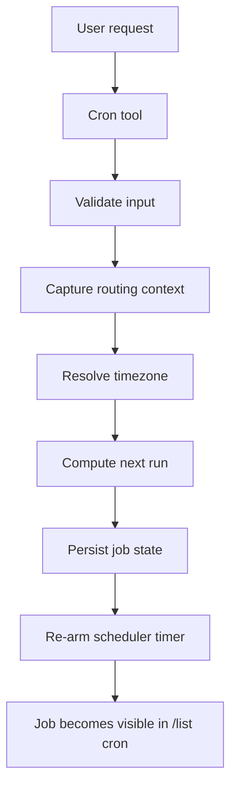
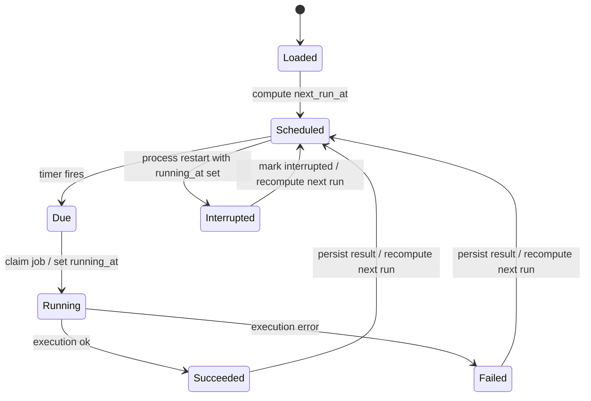

# Cron Architecture

This document describes how `sushiclaw` cron jobs work in the current MVP
implementation.

## Overview

Cron runs inside `sushiclaw gateway`, not as a separate daemon. The gateway
loads jobs from the workspace, keeps scheduler state in memory, and persists
job state back to `cron/jobs.json`.

Each job stores:

- Schedule fields: `at_seconds`, `every_seconds`, or `cron_expr`
- Routing fields: `channel`, `chat_id`, `sender_id`, and optional saved
  `context`
- Runtime state: `next_run_at`, `running_at`, `last_run_at`, `last_status`,
  `last_error`

The scheduler supports three execution modes:

- Agent turn: send the saved message back through the agent session
- Direct delivery: send the saved message directly to the channel
- Command: run a shell command and send the output back as a system message

Cron expressions are interpreted as local wall-clock time in the job
timezone. If no timezone is supplied, the scheduler uses the configured cron
timezone, then falls back to `UTC`.

## Components

- `pkg/cron/store.go` loads and saves the job list
- `pkg/cron/scheduler.go` computes next runs, arms timers, executes jobs, and
  persists results
- `pkg/cron/tool.go` exposes the agent-facing `cron` tool
- `internal/agent/session.go` provides a synchronous cron execution path for
  agent turns
- `internal/gateway/gateway.go` wires the scheduler into the gateway and
  starts it with the rest of the runtime

## Adding A Job

When the agent or CLI adds a cron job, the scheduler:

1. Validates the job shape and required fields
2. Normalizes the routing context from the originating conversation
3. Resolves a timezone for cron expressions
4. Computes the first `next_run_at`
5. Persists the job to `cron/jobs.json`
6. Re-arms the single scheduler timer for the earliest due job

## State Management

The scheduler keeps job state in the store so restarts do not lose progress.
The state lifecycle is:

1. Load jobs at startup
2. Recompute `next_run_at` for enabled jobs
3. Mark stale `running_at` jobs as interrupted on restart
4. Arm a timer for the nearest job
5. Claim the next due job by setting `running_at`
6. Execute the job outside the store lock
7. Persist `last_status`, `last_error`, `last_run_at`, and the next `next_run_at`
8. Repeat

## Failure Handling

- Invalid schedule expressions are recorded as schedule errors and surfaced
  in the job state
- Missing routing context causes the run to be skipped and reported as an error
- Agent turn failures are returned synchronously so cron can mark the job failed
- Command failures are returned after the command output is captured and sent
- One-shot `at_seconds` jobs are disabled after a successful run

## Practical Result

This design gives the MVP the important properties it was missing:

- jobs survive restarts
- the next run is visible and persisted
- a stuck or crashed run is visible in state
- cron can report success or failure instead of silently queueing work
